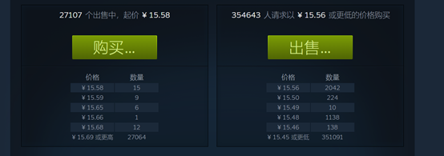
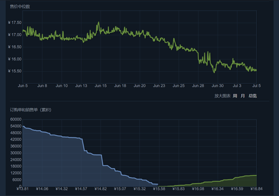

# UBloop
二手书信息收集发布-微信小程序-基础与云开发

### 建议（原想吐槽tx产品）

***请学习网页设计***  
***请更多以行业标准为学习目标***

***内容将于2023.03删除***

### 效果-视频

[B站](https://www.bilibili.com/video/BV1nu4y1v79s/)

### ISBN api

ISBN 识别 api 来源于 [ISBN书号查询 - 聚美智数](https://www.jumdata.com/product/code/isbn_query)，实名认证会有50次的免费调用
使用时请修改 miniprogram/pages/bookinfo/bookinfo.js 中的 getBookFromApi 方法

### 项目中使用的资源

***项目中以及演示视频中的出现的图像或其他资源仅供演示使用***  
***尊重版权，如需采用请联系原作者***  

- logo 与图标
  - [阿里巴巴矢量图标库](https://www.iconfont.cn/)，大多数的图标源  
  - [YEELOGO](https://www.qingnian8.com/)，logo设计  
- 图像  
  - [https://www.pexels.com/](https://www.pexels.com/)  
  - [https://unsplash.com/](https://unsplash.com/)  
  - [https://pixabay.com/](https://pixabay.com/)  
  - [https://www.photock.jp/](https://www.photock.jp/)  
  - 上述网站并非都有采用，参考时有便加入进来  
  - 还有可能部分内容来源于网络  

### 技术参考

- 主要技术文档  
  - [微信开放文档](https://developers.weixin.qq.com/miniprogram/dev/framework/)，微信小程序技术文档  
  - [MDN Web Doc](https://developer.mozilla.org/zh-CN/)，网页技术文档  
- 学习视频，该部分内容是[新视觉实训 B站](https://space.bilibili.com/505082994) 关于微信小程序开发部分的视频内容  
  - [微信小程序基础](https://www.bilibili.com/video/BV1WQ4y1T7D8)  
  - [微信小程序云开发](https://www.bilibili.com/video/BV12z4y1R77r)  
  - [微信小程序组件库](https://www.bilibili.com/video/BV18V411C7VV)，前期有参考，后期组件不合意放弃使用  
  - [微信小程序CMS内容管理](https://www.bilibili.com/video/BV1HA411N7eG)，该部分项目中没有使用  
- 其他参考  
  - [HTML+CSS+JS快速入门](https://blog.csdn.net/weixin_45953673/article/details/120040896)  
  - [色彩参考](https://blog.csdn.net/weixin_39417767/article/details/85003192)，考虑页面和元素配色  
  - [图片取色器/拾色器|菜鸟工具](https://c.runoob.com/front-end/6214/#90a4ae)

**上述说明（效果、api、资源参考、技术参考）是在已完成的内容下所包含的，后续内容以供参考**

### 关于项目开发内容的说明

**这是一个很多内容都还没有完成的作品**  

#### 项目参考

以下平台提供前期调研的项目参考：
- steam市场
- 网易BUFF
- 校园淘书宝（微信小程序）

#### 功能需求

**内容有地区划分，仅展现同一地区的发布内容（但不区分用户，用户可以在多地区发布内容），因为要做线下活动的功能**  
地区计划是以校区来划分，主要服务对象是高校学生  
 
1. 用户发布二手书籍信息（出售或者求购）（书籍信息统一化，使用ISBN识别接口，避免个人编辑的不明确性，提供后期数据分析的高效性）
2. 用户可以预定他人发布的内容，用于用户交易的确认（该功能配合 项目3 内容）
3. 线下交易的活动发起，可以由地区用户投票（提出类似于跳蚤市场的方式促进集中交易，改变零散的交易方式）
4. 线下活动的反馈，用于提供一种交易参考（让用户对 其他计划参与活动的出售用户 是否参加线下活动，以及交易的诚信进行评分，并展示在用户主页供参考）

#### 功能计划

小程序页面功能规划：

- 首页
  - 轮播热门内容
  - 地区热门排行榜（跳转 详情页1）
- 内容发布页
  - 搜索框（跳转 详情页2）
  - 活动宣传项（跳转 详情页3）
  - 个人发布内容展示（仅展示，能跳转 详情页4，没有 详情页6 的功能部分）
  - 扫码搜索书籍按钮（正确识别后跳转 详情页4）
- 关于/个人（综合页）
  - 个人信息（头像、昵称、联系方式、地区）展示
  - 功能项：个人信息（跳转 详情页5）
  - 功能项：个人发布（跳转 详情页6）
  - 功能项：使用公告（跳转 详情页7）
  - 功能项：客服、反馈、登录（注册，跳转 详情页5）/退出登录
- 详情页（非主页面）
  1. 排行榜（跳转参数设置不同内容，出售或求购）
  2. 搜索页（搜索框输入提交、搜索历史（点击可搜索）、搜索结果可跳转 详情页4）
  3. 活动宣传页（如线下交易活动的宣传、投票等）
  4. 书籍详情页（展示书籍信息、关于书籍已发布的内容的数据分析（包括价格与数量、价格趋势折线图）、已发布的内容项（可筛选，可以跳转到发布者主页 详情页5））
  5. 个人信息页面（判别是否是访问他人，提供不同的功能），展示个人信息（自我访问有修改功能）、参与线下活动会的他人评价（开放时访客可评价）
  6. 个人发布作品页，提供对发布内容的修改与删除
  7. 使用说明，介绍一些使用方法，以及说明隐私策略

待确定的功能：私信，由于提供个人联系方式，不想增加太多内容
 
#### 一些内容参考对照

1. 详情页4：已发布内容的价格与数量、价格趋势（参考 steam市场 的商品内容）  
  
  

